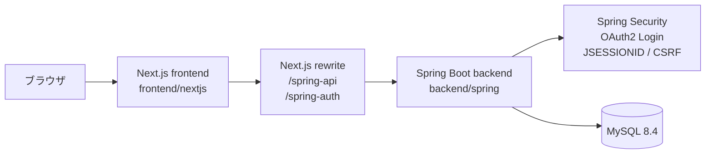
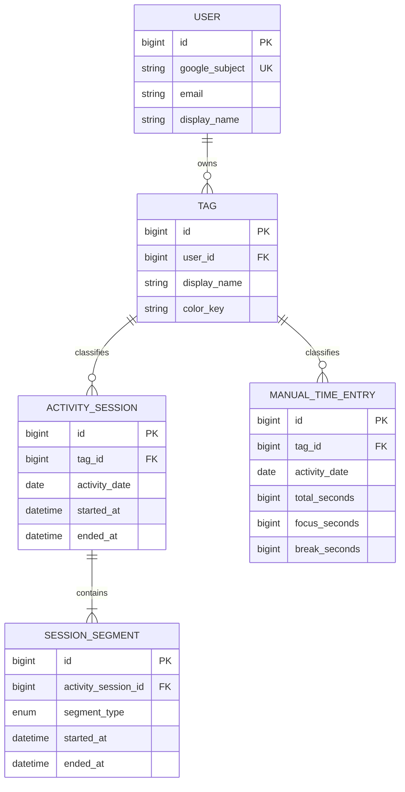

# 01. 全体アーキテクチャ

この資料は、`time-tracker-v3` を最初に理解するための全体像を説明する。
実装の中心は、Next.js のブラウザUI、Spring Boot API、MySQLの3層である。

## 1. まず押さえる全体像



- ブラウザが開く画面は Next.js の `frontend/nextjs/app/page.tsx` である。
- Next.js は `frontend/nextjs/next.config.mjs` の rewrite により、ブラウザから見た同一オリジンの `/spring-api/*` を Spring Boot の `/api/*` へ転送する。
- Googleログインの入口も `/spring-auth/oauth2/authorization/google` という同一オリジンのURLを使い、rewriteでSpring SecurityのOAuth2エンドポイントへ転送する。
- Spring Bootは `backend/spring/src/main/resources/application.properties` の接続情報でMySQLへ接続する。
- ログイン状態はJWTやlocalStorageではなく、Spring SecurityのHTTPセッションと `JSESSIONID` Cookieで管理する。

## 2. リポジトリ内の責務

### frontend

`frontend/nextjs` は、画面表示、ユーザー操作、API呼び出し、APIレスポンスのUI用変換を担当する。

- `app/page.tsx`: `StoreProvider` と `AppShell` の画面入口
- `app/layout.tsx`: metadata、dark theme、Toast、Analyticsの共通レイアウト
- `components/app-shell.tsx`: ログイン画面またはアプリ本体を表示する大枠
- `components/start-form.tsx`: セッション開始フォーム
- `components/active-session.tsx`: 進行中セッションのタイマーと操作
- `components/manual-entry-dialog.tsx`: 時刻付き・時刻なしの手動入力
- `components/records-view.tsx`: 完了済み記録の一覧と削除・セッション編集入口
- `components/tags-dialog.tsx`: タグの追加・名前変更・色変更・削除
- `lib/api.ts`: HTTP APIの唯一の共通入口
- `lib/store.tsx`: React Contextによるサーバー状態の保持、再取得、mutationの集約
- `lib/types.ts` / `lib/time.ts`: UI内部の型と時刻計算

### backend

`backend/spring` は、認証済みユーザーを識別し、入力を検証し、業務ルールを適用してDBを操作する。

- Controller: HTTPの入口とDTOの受け取り
- Service: 所有者チェック、重複チェック、セッション整合性などの業務ルール
- Repository: Spring Data JPAによるDBアクセス
- Entity: `User`、`Tag`、`ActivitySession`、`SessionSegment`、`ManualTimeEntry`
- `schema.sql`: MySQLのテーブル、FK、UNIQUE、CHECK制約
- `SecurityConfig`: OAuth2 Login、セッション、CSRF、APIエラー応答

## 3. 1回のAPI操作の基本経路

代表的な「セッション開始」は次のように流れる。

```text
StartForm.handleStart()
  -> useStore().startSession()
  -> lib/api.ts の startActivitySession()
  -> POST /spring-api/activity-sessions/start
  -> Next.js rewrite
  -> POST /api/activity-sessions/start
  -> ActivitySessionController.start()
  -> ActivitySessionService.start()
  -> ActivitySessionRepository / SessionSegmentRepository
  -> activity_sessions / session_segments
  -> ActivitySessionResponse
  -> runMutation() が refreshAll()
  -> StoreProvider の state 更新
  -> ActiveSession / TodaySummary / RecordsView が再描画
```

Controllerは業務ルールの中心ではない。例えば、同一ユーザーの時間重複禁止は `ActivitySessionService.assertNoOverlap()` が担当し、DBのINSERTだけでは表現しにくいセッション区間の連続性は `validateSegments()` が担当する。

## 4. 主要データの関係



`ActivitySession`は「活動全体の時間枠」、`SessionSegment`はその中の連続した `FOCUS` / `BREAK` 区間である。例えば、1つのセッションを `FOCUS -> BREAK -> FOCUS` と切り替えると、親1件と子3件になる。時刻を持たない手動入力は別モデルの `ManualTimeEntry` であり、開始・終了時刻の代わりに秒数の内訳を保存する。

## 5. frontendの状態の考え方

`StoreProvider` が保持する状態は、次の4種類に分けて読むと理解しやすい。

| 状態 | 実装 | 意味 |
| --- | --- | --- |
| ログイン状態 | `authenticated`, `user`, `hydrated` | APIの結果に基づく画面ガードと初期ロード状態 |
| サーバーデータ | `state.tags`, `state.sessions`, `state.manualRecords`, `summary` | DB/APIを正とする業務データ |
| 派生状態 | `activeSession`, `activeSegment` | `state.sessions`から`useMemo`で求める進行中データ |
| UI/時計状態 | `now`、各Componentの`useState` | 1秒ごとの表示更新、Dialogの開閉、入力途中の値 |

このアプリの実コードには `localStorage` に業務データを書き込む処理はない。更新成功後は `runMutation()` がAPIを再実行し、サーバーのレスポンスを使ってstateを置き換える。

## 6. 開発ガイドラインとの差分

`docs/開発ガイドライン.md` は目標として Zustand、React Hook Form、TanStack Query（React Query）、SWRを挙げている。一方、現行コードでは次の構成で動いている。

- Zustandではなく、`lib/store.tsx` の React Context + `useState` + `useMemo` + `useCallback`
- React Hook Formではなく、各フォームComponentの `useState`
- TanStack Query / SWRではなく、`lib/api.ts` と `StoreProvider.refreshAll()`、15秒間隔の再取得
- 業務データの永続化先はlocalStorageではなく、Spring Boot API経由のMySQL

この資料では、目標方針と現状実装を混同しないよう、現行コードを基準に説明する。

