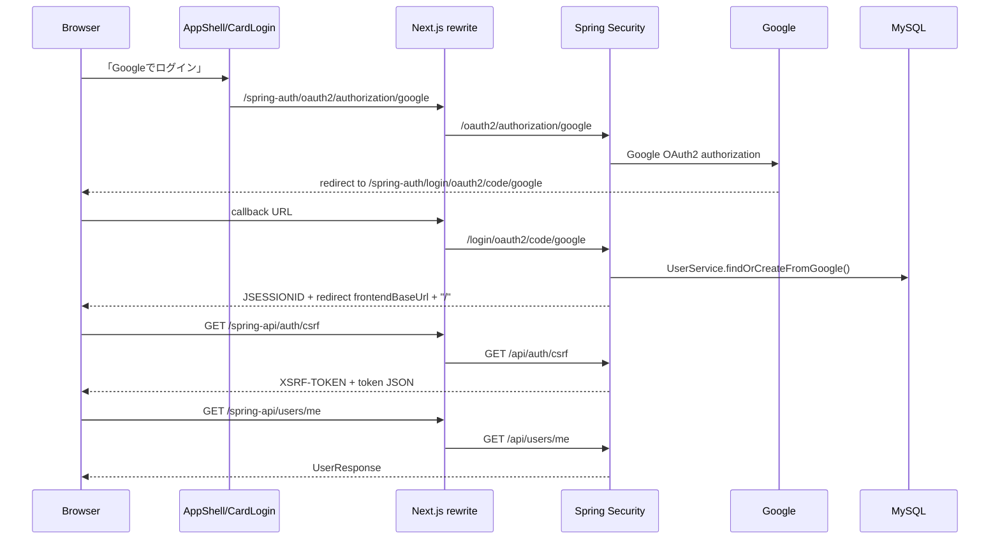

# 02. 主要処理フロー

この資料では、画面上の操作がどのComponent、Hook、API、Springの層、DBを通るかを追う。共通して、frontendのmutationは成功後に `StoreProvider.runMutation()` が `refreshAll()` を実行し、APIから最新データを取り直す。

## 1. 共通の経路

```text
UI操作
 -> Componentのhandler
 -> useStore()から取得した関数
 -> frontend/nextjs/lib/api.ts
 -> /spring-api/* または /spring-auth/*
 -> Next.js rewrite
 -> Spring Controller
 -> Service
 -> Repository
 -> Entity / schema.sqlのDB
 -> Response DTO
 -> api.tsのJSON
 -> StoreProviderのstate更新
 -> Component再描画
```

`lib/api.ts` の `request<T>()` は、JSON body、`Accept`、`credentials: 'same-origin'`、CSRFヘッダー、HTTPエラーの共通処理を担当する。

## 2. Googleログイン



実装箇所は次の通り。

1. `components/app-shell.tsx` の `CardLogin()` が `/spring-auth/oauth2/authorization/google` へのリンクを描画する。
2. `next.config.mjs` の rewrite が `/spring-auth/:path*` を `SPRING_API_URL` のルートへ転送する。
3. `SecurityConfig.oauth2Login()` がGoogle OAuth2 Loginを有効にし、成功時は `authenticationSuccessHandler()`、失敗時は `authenticationFailureHandler()` を使う。
4. 認証後、`CurrentUserService.requireCurrentUser()` が `OAuth2User` から `sub`、`email`、`name` を読み取る。
5. `UserService.findOrCreateFromGoogle()` が `UserRepository.findByGoogleSubject()` で既存ユーザーを探し、なければ `User` を保存し、あればプロフィールを更新する。
6. `StoreProvider` の初期 `useEffect` が `getCsrfToken()`、`getCurrentUser()`、`refreshAll()` の順で呼び出す。

## 3. セッション開始

1. `components/start-form.tsx` の `handleStart()` がタグ、FOCUS/BREAK、区間予定分、セッション予定分を検証する。
2. `useStore().startSession()` が、通常開始日の `dateKey()`、分から秒への変換、`initialSegmentType` を作る。
3. `lib/api.ts` の `startActivitySession()` が `POST /spring-api/activity-sessions/start` を送る。
4. `ActivitySessionController.start()` が `@Valid StartActivitySessionRequest` を受ける。
5. `ActivitySessionService.start()` が次を行う。
   - `lockCurrentUser()` でユーザー行を悲観ロックする。
   - `findOwnedTag()` でタグ所有者を確認する。
   - `validateSessionValues()` で予定値を検証する。
   - `assertNoOverlap()` で既存セッションと時間が重ならないことを確認する。
   - `ActivitySession` と初期 `SessionSegment` を保存する。
6. `ActivitySessionResponse.from()` が親セッションと初期区間をレスポンスへ変換する。
7. `runMutation()` の `refreshAll()` がタグ、全セッション、手動記録、進行中セッション、当日サマリーを再取得する。
8. `activeSession` と `activeSegment` がstateから再計算され、`TimerPanel` が `ActiveSession` を表示する。

代表的なbodyは次のようになる。

```json
{
  "tagId": 1,
  "activityDate": "2026-09-12",
  "initialSegmentType": "FOCUS",
  "segmentPlannedDurationSeconds": 1500,
  "plannedDurationSeconds": 5400
}
```

## 4. FOCUS / BREAK切り替え

1. `components/active-session.tsx` の `handleSwitch()` が現在の区間を反転する。FOCUSならBREAK、BREAKならFOCUSである。
2. `switchSegment(nextDefault)` が `POST /spring-api/activity-sessions/{id}/switch` を送る。
3. `ActivitySessionService.switchSegment()` は、終了済みでないこと、開いている区間がちょうど1件であることを確認する。
4. 次の状態が現在と同じなら予定時間だけ更新する。状態が変わる場合は、現在区間を `current.end(switchedAt)` で閉じ、次の `SessionSegment` を `switchedAt` 開始・`endedAt=null` で保存する。
5. `validateSegments()` が区間の連続性と、最後の区間だけが進行中であることを確認する。
6. frontendはレスポンスを直接手作業でstateへ足さず、`refreshAll()` で再取得する。

## 5. セッション延長

画面の「予定を延長」には2種類ある。

### 現在の区間を延長

- `ActiveSession` が `extendActiveSegment(addMin)` を呼ぶ。
- `StoreProvider` は現在の経過分を計算し、`segmentInput()` で `plannedDurationSeconds` を作る。
- `updateSessionSegment()` が `PUT /spring-api/session-segments/{segmentId}` を送る。
- `SessionSegmentController.update()` -> `ActivitySessionService.updateSegment()` を通る。

### セッション全体を延長

- `ActiveSession` が `extendActiveSession(15)` を呼ぶ。
- `sessionInput()` が `plannedDurationSeconds` を作る。
- `updateActivitySession()` が `PUT /spring-api/activity-sessions/{sessionId}` を送る。
- `ActivitySessionService.update()` が親セッションを更新する。

予定時間に到達しても自動終了はしない。予定は通知と表示の基準であり、実際の終了は `finish()` の操作で決まる。

## 6. セッション終了

1. `ActiveSession` の確認Dialogで「終了する」を押す。
2. `useStore().endSession()` -> `finishActivitySession()` -> `POST /spring-api/activity-sessions/{id}/finish`。
3. `ActivitySessionService.finish()` がユーザーをロックし、所有セッションを取得する。
4. `requireSingleOpenSegment()` で進行中区間を1件に限定する。
5. `ActivitySession.finish(endedAt)` と `SessionSegment.end(endedAt)` を同じトランザクション内で実行する。
6. `validateSegments()` 後、終了済みレスポンスを返す。
7. `refreshAll()` 後、`TimerPanel` は `StartForm` に戻り、記録は `RecordsView` に現れる。

## 7. 進行中セッションの復元

ページを再読み込みしても、タイマーの経過秒数をlocalStorageから復元しているわけではない。

1. `StoreProvider` の初期 `useEffect` がAPIへアクセスする。
2. `refreshAll()` は `getActiveSession()` だけでなく `getActivitySessions()` も呼ぶ。
3. APIレスポンスの `startedAt` / `endedAt` を `toSession()` がepoch millisecondsへ変換する。
4. `activeSession` は `state.sessions.find((session) => session.end === null)` で派生する。
5. `now` は別の `useEffect` が1秒ごとに更新するため、復元後も現在時刻からの経過表示が続く。

`refreshAll()` の一覧にactiveが含まれなかった場合は、`getActiveSession()` の結果を `mappedSessions` に追加する補正もある。

## 8. 手動入力

### 時刻付き

`ManualEntryDialog` の「時刻から」タブでは、開始・終了・合計時間のうち2つを入力する。

1. `submitTimed()` が入力個数を確認する。
2. `addTimedRecord()` が `timeStrToEpoch()` で日付と時刻をepochへ変換する。
3. 開始+終了、開始+合計、終了+合計の3パターンを作り、`createTimedManualSession()` を呼ぶ。
4. `POST /spring-api/activity-sessions/manual` -> `ActivitySessionController.createTimedManual()`。
5. `ActivitySessionService.createTimedManual()` が `TimedRangeResolver.resolve()` を呼ぶ。
6. `TimedRangeResolver` は3パターン以外を拒否し、`TimedRange` を作る。
7. 時刻付き手動記録は、通常の活動セッションと同じ `activity_sessions` + `session_segments` に保存される。ただし予定値は設定されない。

### 時刻なし

1. `submitUntimed()` がFOCUS分・BREAK分を数値化する。
2. `addUntimedRecord()` が分を秒へ変換し、`totalSeconds = focusSeconds + breakSeconds` のbodyを作る。
3. `POST /spring-api/manual-time-entries` -> `ManualTimeEntryController.create()` -> `ManualTimeEntryService.create()`。
4. `ManualTimeEntryService.validateBreakdown()` とDBのCHECK制約が内訳を検証する。
5. `manual_time_entries` に `ManualTimeEntry` が保存される。

## 9. 記録編集

### 現行frontendで編集できるもの

`RecordsView` の完了済みセッションにある鉛筆ボタンが `EditSessionDialog` を開く。現行UIでは次を編集できる。

- セッションのタグ: `updateSessionTag()` -> `PUT /api/activity-sessions/{id}`
- 各区間の FOCUS/BREAK: `updateSegmentType()` -> `PUT /api/session-segments/{id}`
- 各区間の開始日時: `updateSegmentStart()`
- 各区間の終了日時: `updateSegmentEnd()`
- 区間削除: `deleteSegment()`

`ActivitySessionService.updateSegment()` は、区間を前後に移動したときに隣接区間の境界も更新する。例えば中間区間の開始を変えると、直前区間の終了を同じ値にする。最後の区間の終了を変えると、親セッションの終了も更新する。その後 `validateSegments()` で隙間・重複・親範囲外を拒否する。

### backendにはあるが現行UIに未接続の編集

backendには `PUT /api/manual-time-entries/{entryId}` と `ManualTimeEntryService.update()` がある。しかし現行frontendの `lib/api.ts` と `StoreProvider` には `updateManualTimeEntry()` がなく、`RecordsView` にも手動記録の編集ボタンはない。現行UIで手動記録に対して提供されている操作は削除である。

## 10. 記録削除

- セッション削除: `RecordsView` -> `deleteSession()` -> `DELETE /api/activity-sessions/{id}` -> `ActivitySessionService.delete()`。
- 区間削除: `EditSessionDialog` -> `deleteSegment()` -> `DELETE /api/session-segments/{id}` -> `ActivitySessionService.deleteSegment()`。
- 手動記録削除: `RecordsView` -> `deleteManualRecord()` -> `DELETE /api/manual-time-entries/{entryId}` -> `ManualTimeEntryService.delete()`。

所有者付きRepository検索を使うため、別ユーザーのIDを指定しても通常は `ResourceNotFoundException` になる。セッション削除時はDBのFK `session_segments.activity_session_id` の `ON DELETE CASCADE` により区間も削除される。

## 11. タグ作成・編集・削除

1. `TagsDialog` が `addTag()`、`renameTag()`、`updateTagColor()`、`deleteTag()` を呼ぶ。
2. `StoreProvider` は入力の空文字や同一名を先に確認するが、最終判定はbackendでも行う。
3. `lib/api.ts` はそれぞれ `POST /api/tags`、`PUT /api/tags/{tagId}`、`DELETE /api/tags/{tagId}` を呼ぶ。
4. `TagService` は `normalizedDisplayName()`、`normalizeColor()`、所有者検索、重複名確認を行う。
5. タグ削除時は、既存セッション・手動記録があれば `ConflictException`、ユーザーの最後の1件なら `BadRequestException` を返す。
6. 成功後、`runMutation()` が `getTags()` を含む全体再取得を行う。

初回の `GET /api/tags` でタグが0件なら、`TagService.ensureDefaultTags()` が「仕事」「勉強」「瞑想」「余暇」を作る。

## 12. サマリー取得

1. `StoreProvider.refreshAll()` が `dateKey()` で当日を作り、`getSummary(today)` を呼ぶ。
2. `GET /spring-api/summary?activityDate=YYYY-MM-DD` -> `SummaryController.find()`。
3. `SummaryService.find()` がユーザー所有の `ActivitySession` と `ManualTimeEntry` を対象日に絞る。
4. 各活動セッションの区間を `SessionSegmentRepository` から取得し、`FOCUS` / `BREAK` / 合計をタグ別に集計する。
5. `DailySummaryResponse` と `TagSummaryResponse` を返す。
6. `TodaySummary` は当日一致の `summary` があればその値を表示する。一致しない場合は、state内の `activityDate` を使ってfrontend側でフォールバック集計する。

サマリーの当日判定は開始timestampではなく、DB/APIの `activityDate` を使う。これは日跨ぎのセッションや手動入力日を正しく扱うためである。
