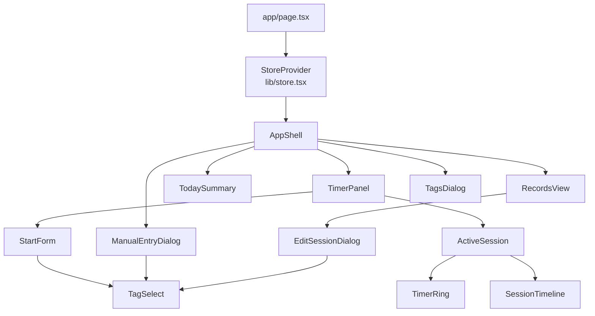

# 03. Frontend解説

frontendは `frontend/nextjs` にあるNext.jsアプリである。画面はClient Component中心で構成され、サーバーの業務データはSpring Boot APIから取得する。ブラウザ側でタイマーを表示するための時計や入力途中の値はReact stateで持つが、記録そのものはlocalStorageに保存しない。

## 1. ディレクトリ構成

```text
frontend/nextjs/
├── app/
│   ├── layout.tsx
│   ├── page.tsx
│   └── globals.css
├── components/
│   ├── app-shell.tsx
│   ├── timer-panel.tsx
│   ├── start-form.tsx
│   ├── active-session.tsx
│   ├── timer-ring.tsx
│   ├── session-timeline.tsx
│   ├── manual-entry-dialog.tsx
│   ├── records-view.tsx
│   ├── edit-session-dialog.tsx
│   ├── today-summary.tsx
│   ├── tags-dialog.tsx
│   ├── tag-select.tsx
│   ├── tag-badge.tsx
│   └── ui/              # UIプリミティブ
├── lib/
│   ├── api.ts           # HTTP API clientとAPI型
│   ├── store.tsx        # React Contextとサーバーデータの保持
│   ├── types.ts         # UI内部型
│   ├── time.ts          # 時刻・期間計算
│   ├── tag-colors.ts    # タグカラー定義
│   └── utils.ts         # className結合
├── next.config.mjs     # backendへのrewrite
├── package.json
└── pnpm-lock.yaml
```

## 2. App Routerの入口

### `app/layout.tsx`

`RootLayout()` はApp Routerの共通レイアウトである。

- `metadata` でタイトルと説明を設定する。
- `<html lang="ja" className="dark">` で日本語・dark themeを設定する。
- `globals.css` を全体へ読み込む。
- `Toaster` を配置し、各Componentの `toast.success()` / `toast.error()` を表示する。
- production時だけ `@vercel/analytics/next` の `Analytics` を表示する。

### `app/page.tsx`

`Page()` は次の2つを配置するだけの薄い入口である。

```tsx
<StoreProvider>
  <main>
    <AppShell />
  </main>
</StoreProvider>
```

ここで `StoreProvider` を最上位に置くため、配下のComponentは `useStore()` で同じstateと操作関数を利用できる。

## 3. 画面Componentの関係



### 大枠

- `AppShell`: `hydrated` がfalseならSkeleton、未認証なら `CardLogin()`、認証済みならヘッダーと3タブを表示する。
- `TimerPanel`: `activeSession` の有無で `StartForm` と `ActiveSession` を切り替える。
- `StartForm`: 新しいセッションのタグ、初期状態、予定分を入力する。
- `ActiveSession`: 進行中区間の経過時間、予定時間、FOCUS/BREAK切り替え、延長、終了を表示する。
- `TodaySummary`: backendの当日サマリーを表示し、必要時にはstateからフォールバック集計する。
- `RecordsView`: 完了済みActivitySessionとManualTimeEntryを活動日ごとに表示する。
- `ManualEntryDialog`: 時刻付き手動セッションと時刻なし手動時間記録を入力する。
- `TagsDialog`: タグ名と色の追加・編集・削除を行う。

`middleware.ts` やNext.jsのMiddlewareによるroute guardは現行frontendにはない。認証画面と本体画面の切り替えは `AppShell` が `hydrated` / `authenticated` を見て行う。ただし、API側は `SecurityConfig` の `.anyRequest().authenticated()` で独立して保護されるため、画面側の表示切り替えだけをセキュリティ境界にはしていない。

## 4. Hookの使われ方

### 独自Hook

独立した `hooks/` ディレクトリはない。主な独自Hookは `lib/store.tsx` にある。

- `useStore()`: `StoreContext`から状態と操作関数を取得する。
- `useTagMap()`: `state.tags`を `{ [tagId]: Tag }` に変換し、タグ表示ComponentがIDからタグを引けるようにする。
- `useReachedNotifications()`: `components/app-shell.tsx` 内のローカルHook。予定時間到達時に音とToastを一度だけ出す。

### React Hook

- `useState`: API状態、認証状態、入力途中の値、Dialog開閉、`now`を保持する。
- `useEffect`: 初期データ取得、15秒間隔の再取得、1秒間隔の時計更新、入力stateの同期に使う。
- `useMemo`: `activeSession`、`activeSegment`、サマリー、記録グループなどの派生値を計算する。
- `useCallback`: `refreshAll()`、mutation、Contextから公開する操作関数の参照を安定させる。
- `useRef`: `useReachedNotifications()` が同じ予定通知を重複表示しないよう、通知済みキーを保持する。

## 5. 現在の状態管理

### `StoreProvider`が持つ状態

`lib/store.tsx` の `StoreProvider()` は次を `useState` で保持する。

| state | 用途 |
| --- | --- |
| `state: AppState` | `tags`、`sessions`、`manualRecords`というDB由来データ |
| `summary: ApiSummary \| null` | 当日のbackendサマリー |
| `user: ApiUser \| null` | `/api/users/me` のユーザー情報 |
| `authenticated: boolean \| null` | 初期判定中・未認証・認証済みの3状態 |
| `hydrated: boolean` | 初期ロード完了後に画面を表示するためのフラグ |
| `now: number` | タイマー表示用の現在epoch milliseconds |

`activeSession` と `activeSegment` はstateに別保存しない。次のように配列から派生する。

```tsx
const activeSession = state.sessions.find(
  (session) => session.end === null,
) ?? null
const activeSegment = activeSession?.segments.find(
  (segment) => segment.end === null,
) ?? null
```

この設計では、サーバーから再取得した `state.sessions` だけを更新すれば、進行中セッション表示も自動的に更新される。

### データ取得と再取得

`refreshAll()` は次の5つを `Promise.all()` で取得する。

```text
getTags()
getActivitySessions()
getManualTimeEntries()
getActiveSession()
getSummary(dateKey())
```

初期 `useEffect` は次の順番で実行する。

1. `getCsrfToken()` でCSRF Cookieを準備する。
2. `getCurrentUser()` でログイン状態を確認する。
3. 成功したら `setAuthenticated(true)` と `setUser()` を行う。
4. `refreshAll()` で画面データを取得する。
5. 最後に `setHydrated(true)` を行う。

認証済み後は別の `useEffect` が15秒ごとに `refreshAll()` を呼ぶ。また、mutation後も `runMutation()` が必ず `refreshAll()` を呼ぶ。

```tsx
const runMutation = async (mutation) => {
  try {
    await mutation()
    await refreshAll()
    return { ok: true }
  } catch (error) {
    return handleFailure(error)
  }
}
```

これは楽観的更新ではなく、API成功後にサーバーを再読込する方式である。UIだけ先に変更してDBとずれる状態を避けやすい一方、更新ごとに再取得が発生する。

## 6. TanStack Query / Zustandの有無

現行frontendの `package.json` と実コードには、TanStack Query、React Query、Zustand、SWRは存在しない。

現在それらに近い役割を担っているのは次の実装である。

| 本来想定される役割 | 現行実装 |
| --- | --- |
| グローバル状態 | `StoreContext`、`StoreProvider`、`useStore()` |
| サーバーデータ保持 | `StoreProvider` の `state` / `summary` |
| query実行 | `lib/api.ts` の各関数と `refreshAll()` |
| mutation後のinvalidate | `runMutation()` 内の `refreshAll()` |
| polling | `setInterval(..., 15000)` を使う `useEffect` |

`docs/開発ガイドライン.md` の目標方針はZustand、TanStack Query、SWRを残している。現行実装は小規模なため、既存画面を壊さない最小構成としてReact Context + API clientを採用している状態である。

## 7. API client

### 共通処理

`lib/api.ts` の `request<T>()` はAPIアクセスを一箇所に集約する。

- `Accept: application/json` を付ける。
- bodyがあれば `Content-Type: application/json` を付ける。
- `GET`等以外では、`document.cookie`から `XSRF-TOKEN` を読み、`X-XSRF-TOKEN` ヘッダーへ設定する。
- `credentials: 'same-origin'` でCookieを送る。
- `/spring-api${path}` をfetchする。
- `204` はbodyなしとして返す。
- エラーは `ApiRequestError(status, message)` に変換する。

### API関数

API関数は画面ComponentがURL文字列やfetch詳細を直接持たないための境界である。

| 種類 | 関数 | HTTP |
| --- | --- | --- |
| 認証 | `getCsrfToken`, `getCurrentUser`, `logout` | `/auth/csrf`, `/users/me`, `/auth/logout` |
| タグ | `getTags`, `createTag`, `updateTag`, `deleteTag` | `/tags` |
| セッション | `getActivitySessions`, `getActiveSession`, `startActivitySession`, `finishActivitySession`, `switchSessionSegment`, `updateActivitySession`, `deleteActivitySession` | `/activity-sessions` |
| 区間 | `updateSessionSegment`, `deleteSessionSegment` | `/session-segments` |
| 手動入力 | `createTimedManualSession`, `getManualTimeEntries`, `createManualTimeEntry`, `deleteManualTimeEntry` | `/activity-sessions/manual`, `/manual-time-entries` |
| 集計 | `getSummary` | `/summary` |

## 8. API型からUI型への変換

backendのDTOは秒、ISO文字列、数値IDを返す。一方、UIはepoch milliseconds、分、文字列IDを扱う。この境界を `store.tsx` の変換関数が担当する。

### `toTag()`

`ApiTag { id: number, displayName, color }` を `Tag { id: string, name, color }` に変換する。colorが空なら `green` を使う。

### `toSession()`

`ApiActivitySession` を `Session` へ変換する。

- `id`, `tagId`: number -> string
- `startedAt`, `endedAt`: ISO string -> `Date(...).getTime()`
- `plannedDurationSeconds`: 秒 -> 分
- `plannedEndAt`: ISO string -> epoch milliseconds
- `segments`: 各 `ApiSegment` を同じ規則で変換
- `activityDate`: `YYYY-MM-DD` の独立した集計対象日としてそのまま保持

### `toManualRecord()`

`ApiManualTimeEntry` の秒を分へ変換し、`displayName`などAPI専用の値をUI内部stateへ持ち込まない。

この変換を入れる理由は、backendの保存形式とUIの表示・計算形式を分離するためである。APIの秒単位やISO形式が変わっても、画面Component全体を直接書き換えずに済む。

## 9. フォームと一時状態

現行コードはReact Hook FormやZodを使っていない。フォームは各Componentの `useState` で管理し、画面上の基本チェックとbackendの `@Valid` / Service検証を組み合わせる。

### `StartForm`

`tagId`、`initialType`、`segPlanned`、`segEnabled`、`sessionPlanned`を保持する。入力分は送信時に `Number()` で数値化され、`StoreProvider.startSession()` が秒へ変換する。

### `ManualEntryDialog`

Dialogの開閉、日付、FOCUS/BREAK、開始時刻、終了時刻、合計分などをComponent内stateで持つ。送信成功後は入力値を空にし、Dialogを閉じる。

### `TagsDialog`

サーバーから取得した `state.tags` とは別に、編集中の名前を `names: Record<string, string>` で保持する。入力途中の名前はDBのタグ名ではなく、blur時に `renameTag()` が成功して初めてサーバーデータになる。

### 一時状態とサーバーデータ

| 一時状態 | サーバーデータ |
| --- | --- |
| Dialogのopen/close | タグ一覧、セッション一覧 |
| 入力途中の文字列 | `ActivitySession`、`SessionSegment` |
| `now` | `ManualTimeEntry`、日次サマリー |
| Toast通知済みキー | 認証済みユーザー |

## 10. タイマー表示

`now` は `StoreProvider` の `useEffect` で1秒ごとに更新される。

1. `ActiveSession` が `segmentDuration(activeSegment, now)` を計算する。
2. `segmentDuration()` は `end ?? now - start` で、進行中なら現在時刻までを返す。
3. `formatDigital()` がミリ秒を `MM:SS` または `H:MM:SS` にする。
4. 予定分があれば `progress = segElapsed / plannedMs` を計算する。
5. `TimerRing` がSVGの円周 `strokeDashoffset` を使って進捗を表示する。
6. 予定を超えると `overtime` となり、円のpulseと「超過」表示を出す。

予定未設定の場合、`TimerRing` は `indeterminate` として進捗円を描かず、経過時間だけを表示する。

`useReachedNotifications()` は `now`、active segment、active sessionを監視し、予定到達時に `playChime()` とToastを実行する。通知済みキーを `Set` に入れるため、1秒ごとの再描画で同じ通知を繰り返さない。

## 11. Next.js rewriteとbackend接続

`next.config.mjs` は `SPRING_API_URL`、次に `NEXT_PUBLIC_SPRING_API_URL`、最後に `http://localhost:8080` を接続先として使う。

```text
/spring-auth/:path* -> ${SPRING_API_URL}/:path*
/spring-api/:path*  -> ${SPRING_API_URL}/api/:path*
```

Docker Composeではfrontendコンテナからbackendコンテナへ到達するため、`SPRING_API_URL=http://backend:8080` を設定する。ブラウザは `localhost:3000` の `/spring-api` へアクセスするだけなので、セッションCookieとCSRF Cookieを同一オリジンとして扱える。

## 12. shadcn/uiとTailwind CSS

`components/ui` はButton、Dialog、Select、Tabs、InputなどのUIプリミティブを提供する。画面Componentはこれらを組み合わせ、業務ロジックと低レベルのアクセシビリティ実装を分離する。

実際の依存・設定は次の通り。

- `app/globals.css` が `tailwindcss`、`tw-animate-css`、`shadcn/tailwind.css` をimportする。
- `components/ui/*.tsx` は `@base-ui/react`、`class-variance-authority`、`lucide-react`などを使う。
- `lib/utils.ts` の `cn()` は `clsx` と `tailwind-merge`でclassNameを結合する。
- 一部のUIプリミティブは `cn`パッケージの `cn` を直接importしている。
- `tag-colors.ts` の色キーとCSS変数を組み合わせ、タグ色・FOCUS・BREAKの見た目を作る。

ここでのshadcn/uiは業務データを管理する状態管理ライブラリではなく、表示部品の集合である。
