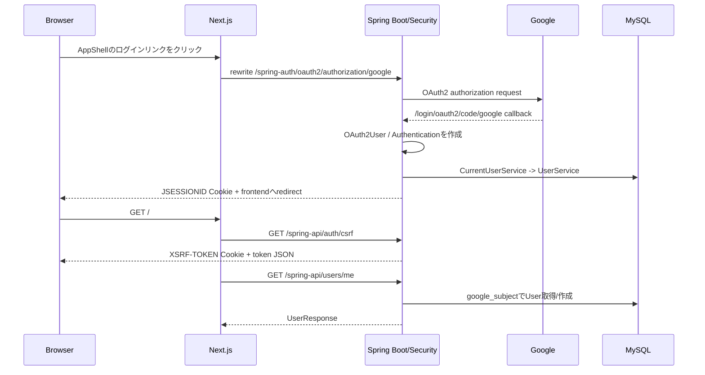

# 05. 認証・セキュリティ

このアプリは、Google OAuth2 Loginを入口にし、ログイン後のAPI認証はSpring SecurityのHTTPセッションで行う。frontendがJWTを保存したり、localStorageへ認証情報を書き込んだりする構成ではない。

## 1. 登場するもの

| 要素 | 実装 | 役割 |
| --- | --- | --- |
| OAuth2 Login | `SecurityConfig.oauth2Login()` | Googleで本人確認し、Spring SecurityのAuthenticationを作る |
| HTTPセッション | Spring Security + Servlet session | 認証済み状態をサーバー側で保持する |
| 認証Cookie | `JSESSIONID` | ブラウザが同じセッションを次のAPI requestへ示す |
| CSRF repository | `CookieCsrfTokenRepository` | CSRF tokenをCookieへ置く |
| CSRF Cookie | `XSRF-TOKEN` | JSが読めるtoken。HttpOnlyではない |
| CSRF header | `X-XSRF-TOKEN` | mutation requestに送るtoken |
| API共通処理 | `frontend/nextjs/lib/api.ts` の `request<T>()` | Cookie送信、CSRF header、APIエラー処理 |

## 2. ログインの流れ



具体的には次の通り。

1. `components/app-shell.tsx` の `CardLogin()` が `/spring-auth/oauth2/authorization/google` のanchorを表示する。
2. `next.config.mjs` の rewrite が `/spring-auth/:path*` を `SPRING_API_URL` のルートへ転送する。つまり、Spring側が受け取る入口は `/oauth2/authorization/google` になる。
3. `SecurityConfig` の `.oauth2Login()` が認可開始、callback、認証成功/失敗を処理する。
4. 認証成功時は `authenticationSuccessHandler()` が `app.frontend-base-url` の `/` へredirectする。失敗時は `/?authError=1` へredirectする。
5. Spring Securityは認証情報をHTTPセッションへ保存し、ブラウザには `JSESSIONID` を返す。
6. `CurrentUserService.requireCurrentUser()` は `SecurityContextHolder` から `Authentication` を取得し、principalが `OAuth2User` であることを確認する。
7. `sub`、`email`、`name` が空なら `UnauthorizedException` を投げる。
8. `UserService.findOrCreateFromGoogle()` が `google_subject`をキーに `User` を取得または作成する。

## 3. JSESSIONIDとHttpOnly Cookie

`backend/spring/src/main/resources/application.properties` は次を設定する。

```properties
server.servlet.session.cookie.name=JSESSIONID
server.servlet.session.cookie.http-only=true
server.servlet.session.cookie.secure=${SESSION_COOKIE_SECURE:false}
server.servlet.session.cookie.same-site=${SESSION_COOKIE_SAME_SITE:lax}
server.servlet.session.cookie.path=/
```

- `JSESSIONID` はサーバーセッションを指す識別子である。
- `HttpOnly=true` のため、frontend JavaScriptは認証Cookieの値を読み取れない。これにより、通常の画面JavaScriptからセッション識別子を直接取得する設計にならない。
- API clientは `credentials: 'same-origin'` を設定するだけで、ブラウザにCookie送信を任せる。
- ローカルComposeの既定値は `SESSION_COOKIE_SECURE=false`、`SameSite=lax` である。HTTPS環境ではSecure設定とドメイン設計を確認する必要がある。

## 4. CSRF tokenの流れ

Spring SecurityのCSRFは、認証Cookieを自動送信するブラウザに対して、別途「この操作を意図したfrontendから送った」ことを確認する仕組みである。

### backend側

`SecurityConfig.csrfTokenRepository()` は `CookieCsrfTokenRepository.withHttpOnlyFalse()` を使う。

- Cookie名はSpring Security既定の `XSRF-TOKEN`。
- `withHttpOnlyFalse()` により、frontendが `document.cookie` から読み取れる。
- `path=/`、Secure、SameSiteはセッションCookie設定に合わせている。
- `SpaCsrfTokenRequestHandler` は、レスポンス/リクエスト属性にはXOR maskingを維持しつつ、headerから来たtokenはCookieのraw tokenとして検証できるようにする。

`AuthController.csrf()` は `GET /api/auth/csrf` で `CsrfToken` を受け取り、`{"token":"..."}` を返す。このGETを呼ぶ過程で `XSRF-TOKEN` Cookieが準備される。

### frontend側

`lib/api.ts` の `request<T>()` は、GET/HEAD/OPTIONS以外のrequestで次を実行する。

```text
document.cookieから XSRF-TOKEN を読む
  -> X-XSRF-TOKEN headerへ設定
  -> credentials: same-originでfetch
```

初期ロードでは `StoreProvider` が先に `getCsrfToken()` を呼ぶため、作成・更新・削除・logoutの前にtokenを準備できる。

対象となるmutationの例:

- `POST /api/activity-sessions/start`
- `POST /api/activity-sessions/{id}/finish`
- `POST /api/activity-sessions/{id}/switch`
- `PUT` / `DELETE` の各API
- `POST /api/auth/logout`

## 5. API認証の判定

`SecurityConfig.securityFilterChain()` は次のURLだけをpermitAllにする。

```text
/api/auth/csrf
/oauth2/**
/login/**
```

それ以外は `.anyRequest().authenticated()` である。API `/api/**` に対して認証がない場合は、`HttpStatusEntryPoint(HttpStatus.UNAUTHORIZED)` により401を返す。認証済みでもCSRF不正などで拒否された場合は、API専用AccessDeniedHandlerが403とJSON `{"message":"Request is forbidden"}` を返す。

frontendの `ApiRequestError` はstatusを保持する。`StoreProvider.handleFailure()` は401を受けると `authenticated=false`、`user=null` にし、`AppShell` がログイン画面を表示する。

## 6. logout

1. `AppShell`のログアウトボタンが `useStore().logout()` を呼ぶ。
2. `lib/api.ts` の `logout()` が `POST /spring-api/auth/logout` を送る。
3. API clientは通常のmutationと同じく `X-XSRF-TOKEN` を付ける。
4. `SecurityConfig.logout()` が `/api/auth/logout` を処理する。
5. `.invalidateHttpSession(true)`、`.clearAuthentication(true)`、`deleteCookies("JSESSIONID", "XSRF-TOKEN")` が実行される。
6. 成功時は204を返し、frontendは認証stateと業務stateを空にする。

## 7. Next.js経由のAPIアクセス

ブラウザからbackendの `http://backend:8080` を直接参照していない。Docker Composeでは、frontendのNext.jsサーバーがbackendへのrewriteを行う。

```text
Browser:  /spring-api/activity-sessions/start
Next.js:  SPRING_API_URL=http://backend:8080
Backend:  /api/activity-sessions/start
```

同じブラウザオリジンのURLを使うため、`JSESSIONID` と `XSRF-TOKEN` のCookieをfrontendとbackend間でCORS設定なしに扱える。API clientが固定的に `/spring-api` をprefixするのもこの構成に対応するためである。

## 8. 認証情報を保存する場所

現行実装では、次のものをlocalStorageへ保存しない。

- Google access token
- JSESSIONID
- XSRF-TOKEN
- セッションやタグなどの業務データ

JSESSIONIDとXSRF-TOKENはCookie管理をブラウザに任せ、業務データはAPI再取得で復元する。

## 9. 手動確認が必要な範囲

統合テストではMockMvcによる認証、CSRF、所有者チェックを確認できるが、実際のGoogleアカウントを使うOAuth認可画面とcallbackは別途確認が必要である。特に、Google Consoleに登録したredirect URIが `GOOGLE_REDIRECT_URI` と一致すること、HTTPS本番環境で `SESSION_COOKIE_SECURE=true` とSameSite方針が合っていることを確認する。

