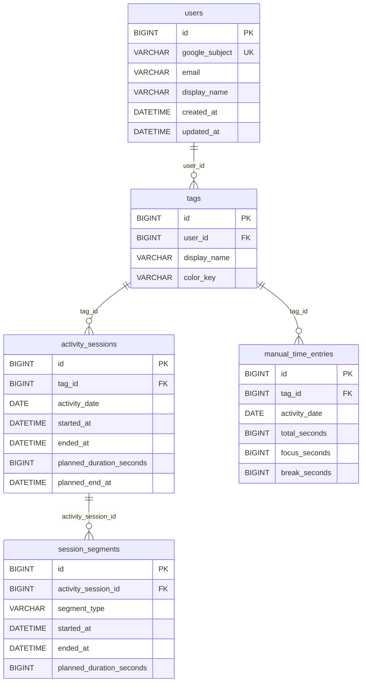

# 06. DB・データモデル

DB定義の実体は `backend/spring/src/main/resources/db/schema.sql` である。JPA EntityはDB行をJavaオブジェクトとして扱うための対応物であり、Entityだけでschemaを自動生成する設定ではない。

## 1. 全体の関係



JavaのEntityと対応するテーブルは次の通り。

| Java Entity | テーブル | 主な関連 |
| --- | --- | --- |
| `User` | `users` | `User 1 -> N Tag` |
| `Tag` | `tags` | `Tag N -> 1 User` |
| `ActivitySession` | `activity_sessions` | `ActivitySession N -> 1 Tag` |
| `SessionSegment` | `session_segments` | `SessionSegment N -> 1 ActivitySession` |
| `ManualTimeEntry` | `manual_time_entries` | `ManualTimeEntry N -> 1 Tag` |

`User`からタグや記録を直接Javaコレクションで辿る双方向関係は定義されていない。各子Entityが `@ManyToOne` で親を参照し、Repository queryが親のIDを条件にする形である。

## 2. User

`User` はGoogleログインしたアプリ利用者である。

- `id`: `users.id` の主キー
- `googleSubject`: Googleの `sub`。`UNIQUE`でユーザー照合に使う
- `email`, `displayName`: Google claimsから取得する表示情報

`CurrentUserService.requireCurrentUser()` がログイン中の `OAuth2User` から `sub`、`email`、`name`を取り出し、`UserService.findOrCreateFromGoogle()` がUserを取得または作成する。

## 3. Tag

`Tag` は「仕事」「勉強」などの分類である。

- `user_id`で所有者を表す。
- `(user_id, display_name)`にUNIQUE制約があり、別ユーザーなら同名でもよい。
- `color_key` は `green`、`sky`、`violet`、`amber`、`rose`、`slate` のいずれかをServiceが許可する。
- `TagService.findAllForCurrentUser()`でタグが0件の場合、デフォルトタグ4件を作る。

## 4. ActivitySessionとSessionSegment

### ActivitySession

`ActivitySession`は、一つの活動を開始してから終了するまでの大きな時間枠である。

- `activityDate`: どの日の記録として集計するか
- `startedAt`, `endedAt`: 実際の時間範囲。進行中はendedAtがNULL
- `plannedDurationSeconds` または `plannedEndAt`: 任意の予定
- `tag`: 活動分類

### SessionSegment

`SessionSegment`はActivitySession内の区間で、`segmentType`が `FOCUS` または `BREAK` になる。

例えば、次の操作はDBでは1件の親と3件の子になる。DBの外部キーだけでは子を1件以上にすることはできないため、実際の「最低1区間」のルールは `ActivitySessionService` が保証する。

```text
ActivitySession: 09:00 - 11:00
  SessionSegment: FOCUS 09:00 - 09:25
  SessionSegment: BREAK 09:25 - 09:30
  SessionSegment: FOCUS 09:30 - 11:00
```

分ける理由は、親の活動全体と、その中でFocus/Breakがどう切り替わったかを別々に保持するためである。親だけに `focusSeconds` と `breakSeconds` を持たせると、切り替え時刻、区間ごとの編集、タイムライン表示を表現できない。

### FOCUS / BREAKの表現

- Java: `SegmentType` enum
- Entity: `@Enumerated(EnumType.STRING)`
- DB: `segment_type VARCHAR(6)` と `CHECK (segment_type IN ('FOCUS', 'BREAK'))`
- frontend API型: `type SegmentType = 'FOCUS' | 'BREAK'`

文字列で保存するため、Java enumのordinal番号に依存しない。DB側でも許可値を制限する。

## 5. ManualTimeEntry

時刻が分からない活動を記録する別モデルである。

- `activity_date`: 対象日
- `total_seconds`: 合計秒
- `focus_seconds`: FOCUS秒
- `break_seconds`: BREAK秒

`ManualTimeEntry` は開始時刻・終了時刻・セグメントを持たない。frontendの「時間だけ」タブから `POST /api/manual-time-entries` で作られ、`ManualTimeEntryService.validateBreakdown()` が合計と内訳を確認する。

一方、手動入力の「時刻から」タブは `ActivitySessionService.createTimedManual()` を通るため、時刻を持つ `ActivitySession` + `SessionSegment` として保存される。この2種類を区別することが重要である。

## 6. 外部キーと削除方針

`schema.sql` の外部キーは次の通り。

| 親 | 子 | `ON DELETE` | 意味 |
| --- | --- | --- | --- |
| `users` | `tags` | `RESTRICT` | User削除でタグ・記録を連鎖削除しない |
| `tags` | `activity_sessions` | `CASCADE` | タグ削除時にセッションをDB上で連鎖削除できる |
| `tags` | `manual_time_entries` | `CASCADE` | タグ削除時に手動記録をDB上で連鎖削除できる |
| `activity_sessions` | `session_segments` | `CASCADE` | セッション削除時に区間も削除する |

ただし通常のタグ削除は `TagService.delete()` を通り、使用中タグなら `ConflictException` を返す。つまり、CASCADEは参照整合性のDB側の保護であり、通常の画面操作ではServiceの業務ルールが先に働く。

## 7. DB制約

### DBで表現できる制約

`schema.sql` は次を設定している。

- 主キーと `AUTO_INCREMENT`
- `NOT NULL`
- `users.google_subject` のUNIQUE
- タグ名の `(user_id, display_name)` UNIQUE
- 外部キー
- `ended_at IS NULL OR ended_at > started_at`
- 予定秒がNULLまたは1以上
- `planned_duration_seconds` と `planned_end_at` の同時指定禁止
- `segment_type` が `FOCUS` / `BREAK`
- `total_seconds = focus_seconds + break_seconds`

これは一つの行だけを見て判断できるルールである。

### Serviceで必要な制約

次は複数行や認証ユーザーとの関係を見るため、`ActivitySessionService`が担当する。

- 同一ユーザーのActivitySession同士の時間重複禁止
- 進行中ActivitySessionを同一ユーザーで1件にすること
- セグメント間の隙間・重複禁止
- セグメントが親の範囲内にあること
- 完了済み親の最後までセグメントが連続すること
- 進行中親の最後のセグメントだけがopenであること
- 対象IDがログインユーザーの所有物であること

## 8. overlapの判定

`ActivitySessionService.assertNoOverlap()` は、ユーザーの全セッションを取得し、更新対象自身を除外して `overlaps()` を適用する。

```java
boolean leftBeforeRightEnd = rightEnd == null || leftStart.isBefore(rightEnd);
boolean rightBeforeLeftEnd = leftEnd == null || rightStart.isBefore(leftEnd);
return leftBeforeRightEnd && rightBeforeLeftEnd;
```

終了時刻NULLは「現在も続いている」と扱う。境界がちょうど接しているだけなら重複ではなく、開始が相手の終了より前、または相手の開始が自分の終了より前の場合に重複と判断する。

セッション開始・終了・切り替え・更新では `lockCurrentUser()` が `UserRepository.findByIdForUpdate()` を使う。これにより同じユーザーの同時操作を直列化し、二重開始や重複判定の競合を抑える。

## 9. activity_dateと時刻の違い

`activity_date` は `started_at` からDBが自動計算する値ではない。

- 通常開始: frontendの `dateKey()` で開始時点のローカル日付を作る
- 時刻付き手動入力: `ManualEntryDialog`が指定した日を送る
- 時刻なし手動入力: 入力日をそのまま送る
- frontendの記録グループ・当日サマリー: `activityDate`を使う
- overlap判定: `activity_date`ではなく `started_at` / `ended_at`を使う

この分離により、例えば指定日23:30から翌日00:30までの活動を、指定した活動日の記録として集計しつつ、時間重複は実時間で判定できる。

## 10. Entityとschemaの初期化

`application.properties` は `spring.jpa.hibernate.ddl-auto=none` としている。起動時は `spring.sql.init.mode=always` と `spring.sql.init.schema-locations=classpath:db/schema.sql` によりschema.sqlを実行する。

`schema.sql` は基本テーブルを `CREATE TABLE IF NOT EXISTS` で作り、既存DBに `tags.color_key` がない場合だけinformation_schemaを確認してALTER TABLEする。FlywayやLiquibaseのバージョン付きmigrationは現在導入されていない。
